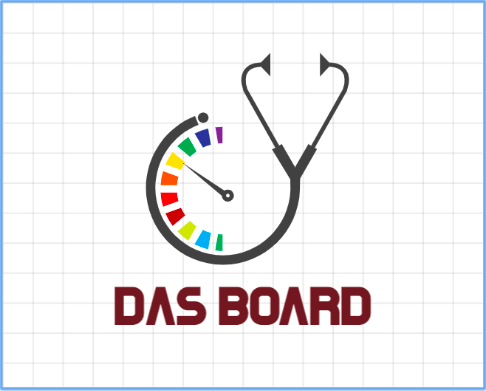
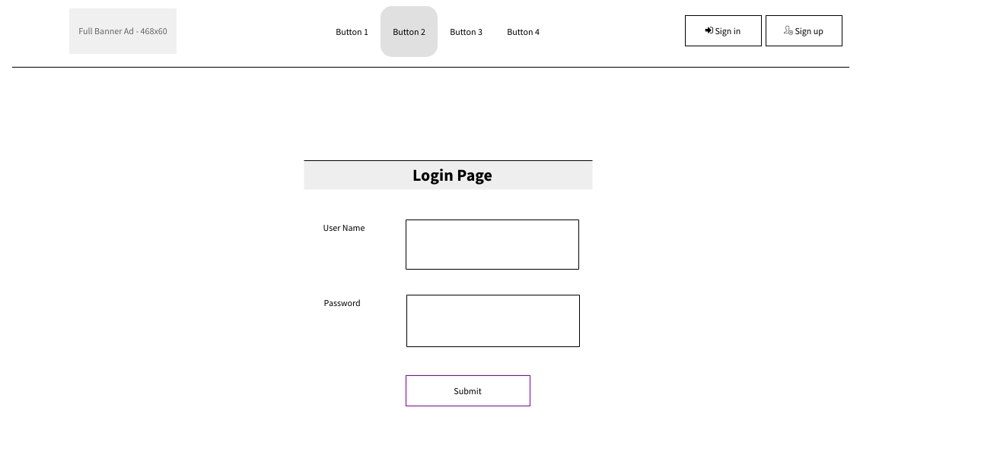
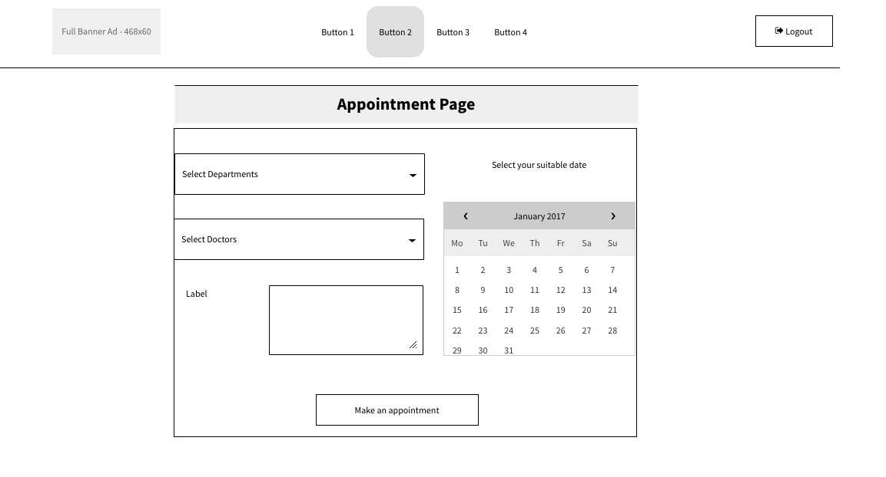
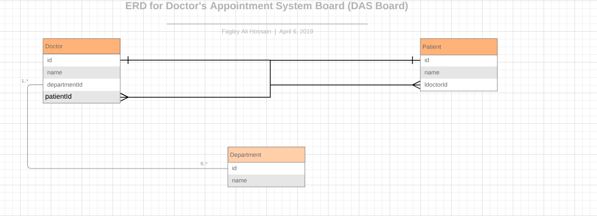

##### This app is for making appointment schedule with the listed docotors of different segment. Doctors and patients are the main users of this app. 

## Table of contents
* [General info](#general-info)
* [Screenshots](#screenshots)
* [Technologies](#technologies)
* [Links](#links)
* [RESTful API endpoints](#RESTful_API)
* [Problems](#problems)
* [Future enhancement](#futures)
* [Setup](#setup)
* [Features](#features)
* [Status](#status)
* [Inspiration](#inspiration)
* [Contact](#contact)

## General info
It actually help patients to get an appointment with his/her doctor online. Doctor also can see how many patients are scheduled for a day. It also tracks patient profile. 

## Screenshots

## Technologies
* HTML5, JavaScript ES6, CSS3, 
* Mongoose - version
* Express.Js - version 2.0
* React.JS - version 11.0
* Node.Js - version 

## Links

* [pitch-deck](https://github.com/fagleyali/dasboard)
* [trello](https://trello.com/b/UEm5OT2v/das-board)
* [Heroku](https://id.heroku.com/login)

## RESTful_API

RESTful API documentation.

## Project Challenges
1. Time: Time is very short to build up a full stack web application by a group of new developers. 
2. Github: Its getting on our nerves to resolve conflicts with .pyc. But learned a lot of these. 
3. APIs: We searched for APIs to use, but didn't find any related things.
4. Migrations: Model designing should be carefully crafted before starting coding.
5. Heroku migrations: Another problem we found to migrate the modified model in the heroku. 

## Features
This app has some cool features! Such as:
1. There should three types of user, such as: Doctors, Patients and Admin
2. We used one to one relation and many to many relation.

## Futures
There are a lot of thing we can do if we have some time

## Setup
Describe how to install / setup your local environement / add link to demo version.

## Code Examples

## To-do list:
* to make presentable front-end design
* to choose Api for our project
* to make all skeleton components
* to make install Express, Node and Mongoose 
* to implement three types role based users authentication
* to deploy the completed project in Heroku

## Status
Project is: pre project work just started. We are preparing the set up for the project, collecting accessories, images, apis. 

## Inspiration
Add here credits. Project inspired by #GENERAL ASSEMBLY#

## Contact
Created by [@DATX team]- feel free to contact us!

